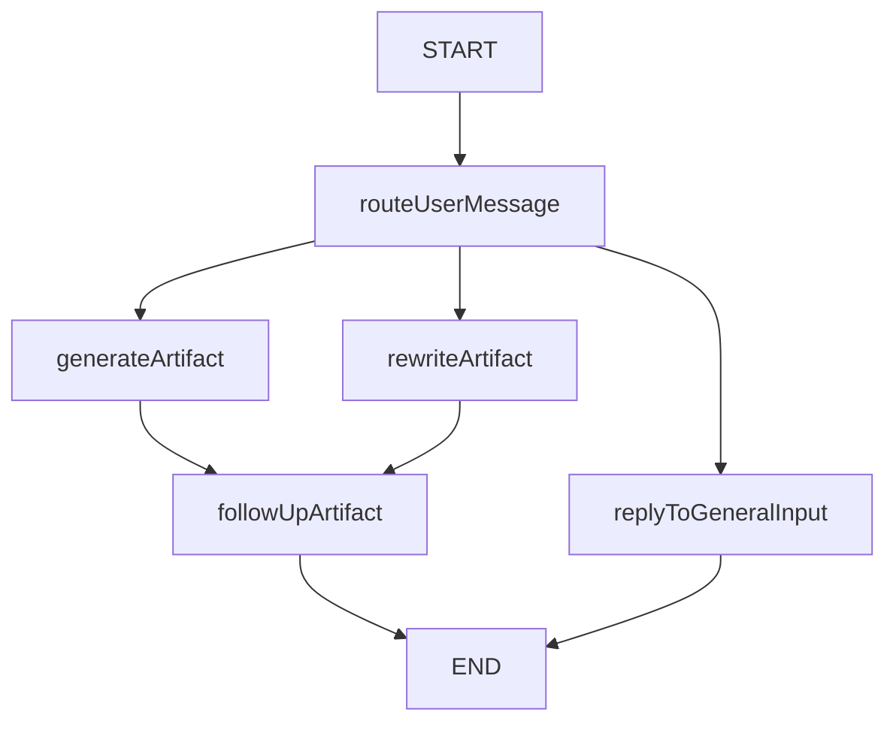

# 💁 📜 🐝 Bee Canvas

A co-editing agent built using [Bee workflows](https://i-am-bee.github.io/bee-agent-framework/), [Granite 3.1](https://www.ibm.com/granite/docs/models/granite/) and [ollama](https://ollama.com).

Inspired by [open-canvas](https://github.com/langchain-ai/open-canvas).

## ✨ Key Features

- Generate & update co-editable artifacts (Markdown & Code)
- Implemented using Bee Workflows 💪

## ✨ Agent Architecture



## ✨ Demo

https://github.com/user-attachments/assets/4705adaf-a3d5-4e00-a0ac-d19914c7e4fd

## 📦 Requirements

- JavaScript runtime [NodeJS > 18](https://nodejs.org/) (ideally installed via [nvm](https://github.com/nvm-sh/nvm)).
- Local [ollama](https://ollama.com)

The agent uses `granite3.2:8b`. If you don't have `granite3.2:8b` pulled, run the following ollama command.

```
ollama pull granite3.2:8b
```

## 🛠️ Getting started

1. Clone this repository.
2. Install dependencies `npm ci`.
3. Configure your project by filling in missing values in the `.env` file (default LLM provider is locally hosted `Ollama`).
4. Run the agent `npm run start src/agent.ts`
